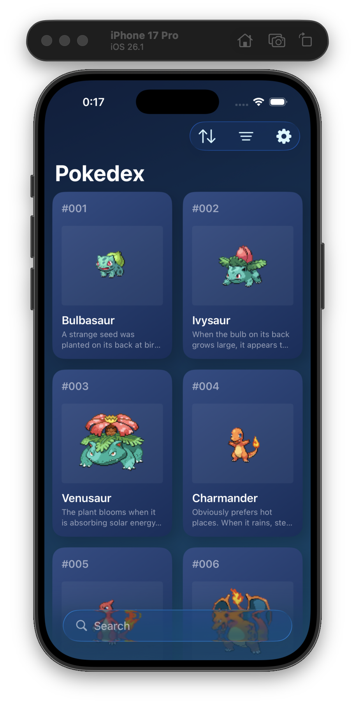

# Pokedex with Codex-CLI

  

GPT-5.1-Codex-Max 主に Medium を使用

コミットメッセージの作成は任せられるが、時間がかかる上に的外れなものを作成されることがある。

現環境に関する理解は当然ない。

@concurrent を付与できるメソッド等には、積極的に@concurrent を付与しようと考えたが、コンテキストスイッチを考慮すると Usecase に対してのみ@concurrent を付与するのがよさそう。

抽象型に依存させるためには、プロンプトにその旨を記載するといい。
もしくは、事前に Protocol ファイルだけでも用意しておく。
→ 不要なメソッドの作成を防ぐため、事前に Protocol は定義しておいた方がいいかもしれない。

public extension Sample {
func action() {}
}

action メソッドのアクセスレベルは public になる。

ユーザーファーストな実装（ロジック）に関しては少々苦手な模様。ポケモンのキャッシュ（保存）が Task.detached で行われていない点など。

たまにコメントを入れてくる。

アクセスレベルを public に設定した場合、明示的に Sendable に準拠させる必要がある。

デコード用のイニシャライザも自動的に public になる模様。

「if !isShowingSettingsView {}」のような反転の「!」を使うので、AGENTS.md に注意書きを追加したほうがいいかもしれない。

UI の作成に関しては、デザイン自体は割と良いがコードには粗があることが多い。
また、現時点では ObservableObject を使う。
